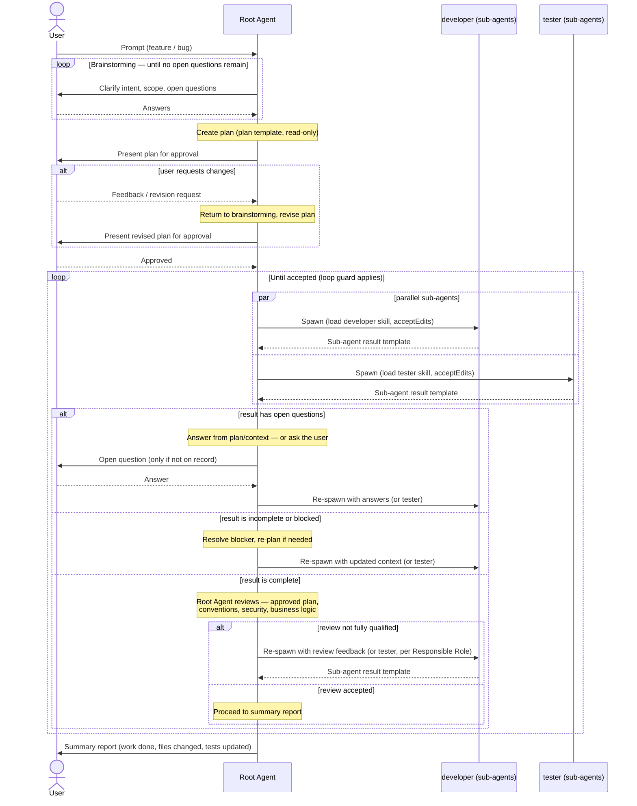

# Workflow Diagram

> **Parallel-by-default**: developer and tester can run concurrently when the project's testing workflow is `Test-First` (tester writes specs from the requirement) or when developer and tester scopes don't overlap. When `Code-First` and the tester depends on the developer's diff, run them sequentially.
